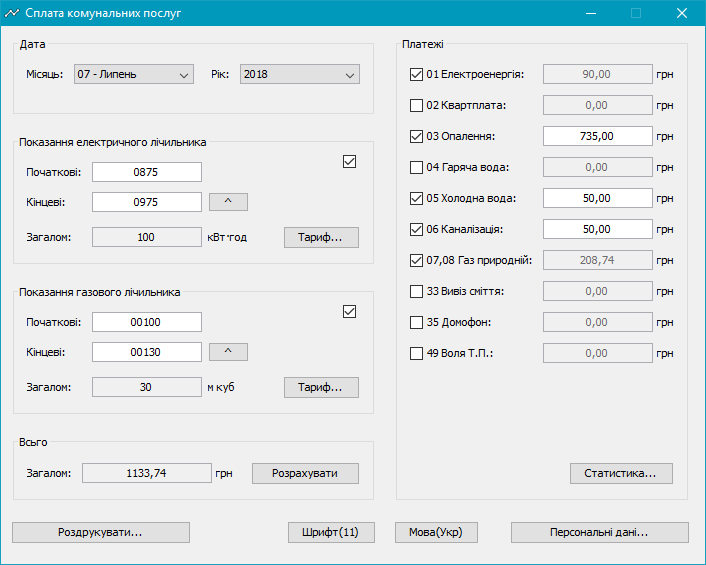
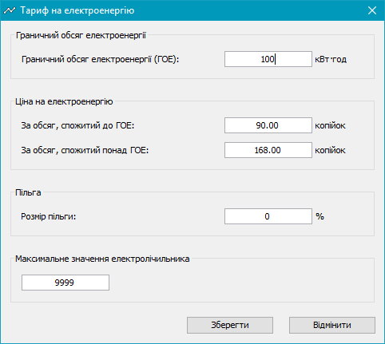
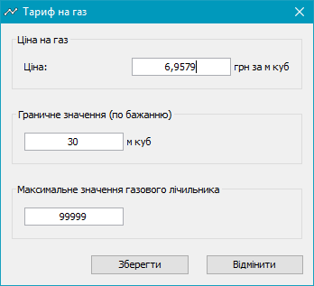
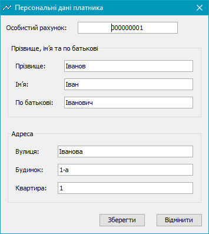
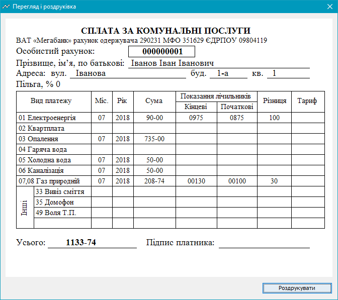
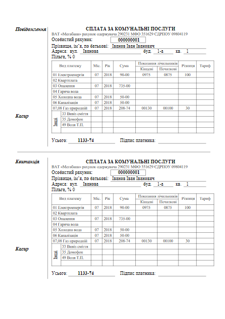
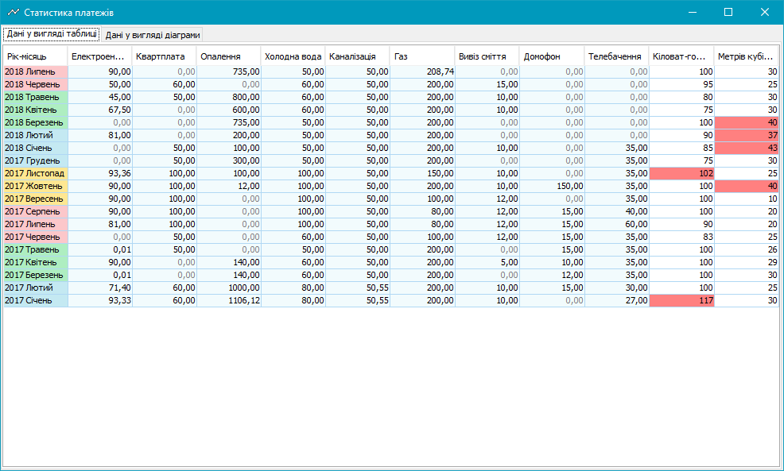
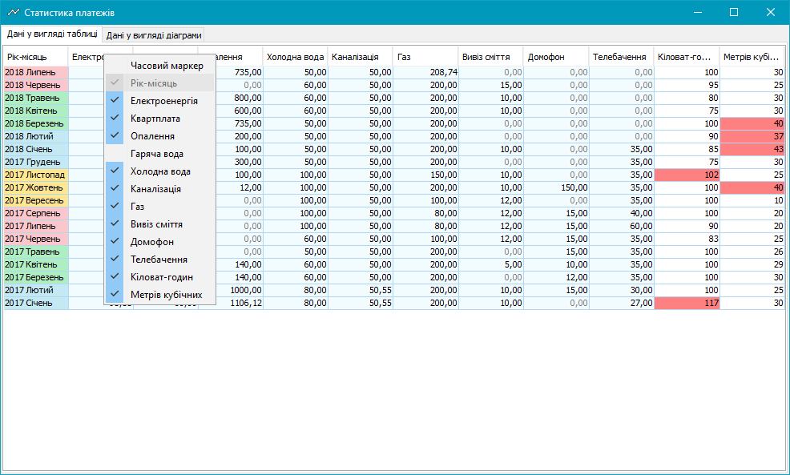
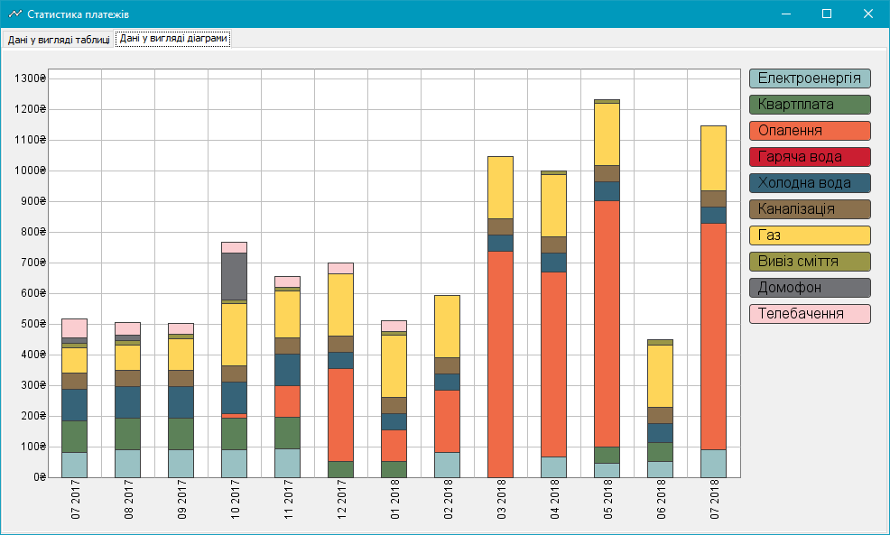
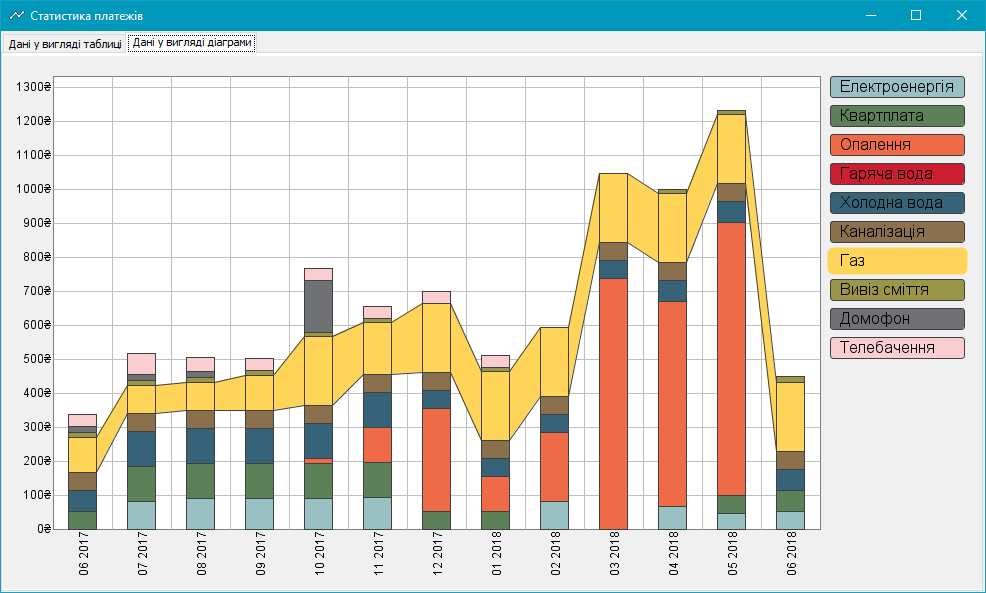

## UtilitiesCalculator
Данное приложение призвано упростить ежемесячные хлопоты по подсчётам оплаты комунальных услуг. С его помощью можно создать и распечатать квитанцию, в которой будут все необходимые данные для оплаты в банковской кассе. Дополнительно к этому, приложение сохраняет все данные об оплате, которые используются в виде статистики, для для наглядного отображения какие суммы на какие услуги были затрачены.

Главное окно приложения имеет вид показанный на рисунке 1.

Рисунок 1 - Главное окно приложения UtilitiesCalculator

На главном окне присутствует пять панелей. Панель даты, на которой автоматически устанавливаются текущий месяц и год; панель показаний электросчётчика; панель показаний газового счётчика; панель позиций по которым производится оплата; и панель общей суммы к оплате.
Не обязательно использовать панели показаний электросчётчика и газового счётчика. Например, при отсутствии газового счётчика, можно отключить соответствующую панель и вводить сумму самому (в панели платежей).
В панелях электросчётчика и газового счётчика есть кнопки открывающие диалоговые окна в которых нужно указать соответствующие тарифы и некоторые другие данные. Эти диалоговые окна имеют виды как на рисунке 2 и 3, соответственно.

Рисунок 2 - Диалоговое окно тарифа на электроенергию

Как видно из рисунка 2, в данных о тарифе на электроенергию также необходимо указать граничный объём электроенергии в киловаттах в час, до достижения которого сумма вычисляется по одной цене, а после - по другой. Указываются цены на электроенергию. Размер льготы, если таковая имеется. А также максимальное значение вашего электросчётчика, которое необходимо в некоторых расчётах.

Рисунок 3 - Диалоговое окно тарифа на газ

На рисунке 3 видно, что в данных о тарифе на газ указывается цена в гривнах за кубометр газа, указывается максимальное значение газавого счётчика, а также, при желании можно указать граничное значение в матрах кубических (данное значение используется в части приложения отвечающем за статичтику, см. ниже).

В панели платежей вибираются желаемые позиции, которые будут учитываться при составлении квитанции. Если вы пользуетесь счётчиком электроенергии, можно корректировать сумму соответствующего платежа, при желании округляя её. То же самое для газа.

Диалоговое окно персональных данных имеет вид как на рисунке 4, в нём необходимо указать ваши персональные данные. А именно, ваш персональный счёт, который указан в квитанции присылаемой вам по почте, ваша фамилия, имя, отчество и адрес.

Рисунок 4 - Диалоговое окно персональных данных

При нажатии кнопки печати, вначале откроется диалоговое окно предварительного просмотра, в котором можно проверить правильность введённых данных. Оно имеет вид как на рисунке 5.

Рисунок 5 - Диалоговое окно предварительного просмотра

После печати лист квитанции имеет вид, показанный на рисунке 6:

Рисунок 6 - Распечатанный лист квитанции

Это было описание основного функционала данной приложения. Дополнительный функционал описан ниже.

К дополнительным функциям относится сбор данных об оплате и демонстрация их в табличном виде и в виде графика. Каждый раз, после успешной печати квитанции сохраняются следующие данные: часовой маркет - время когда была произведена печать, данные о месяце и годе платежа, суммы всех позиций платежей, количество использованных киловатт электроенергии и кубометров газа.
В колонке "год-месяц" данные подсвечиваются в зависимости от периода года. Данные в колонках о платежах подсвечиваются цветом близким к безюзовому, а в колонках о данных об электроенергии и газе красным подсвечиваются места, когда была превышена установленная граница. Табличный вид статистики имеет вид показанный на рисунке 7.

Рисунок 7 - Окно статистики в табличном виде (отдельная закладка)

При этом в контекстном меню шапки таблицы можно выбрать какие колонки показывать, а какие скрыть. Это продемонстрировано ниже на рисунке 8.

Рисунок 8 - Выбор отображаемых колонок

В другой закладке можно просмотреть данные о платежах за предыдущие 13 месяцев (чтобы можно было сравнить текущий месяц с аналогичным месяцем прошлого года). Данные о статистике берутся из файла созданного приложением и в который они каждый раз добавляются. При желании можно вручную добавить данные за прошлые периоды, когда вы ещё не пользовались приложением (см. ниже).
(TODO: информация об осях) Окно с данными платежей в виде графика имеет вид показанный на рисунке 9.

Рисунок 9 - Окно статистики в виде графика (отдельная закладка)

В данном окне есть возможность просмотра конкретной позиции в режиме выделения из общей картины. Для этого нужно нажать на соответствующую кнопку, например, для позиции "газ" график будет иметь вид как на рисунке 10.

Рисунок 10 - Окно статистики в виде графика с выделением оплаты по газу

(TODO: информация о добавлении данных в файл сбора ститистики)
